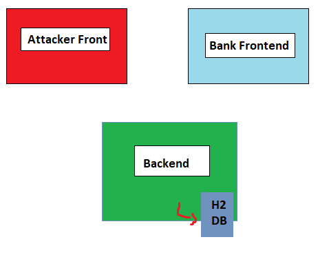

# CSRF-Attack

<!-- Links -->
[Trello Backlog](https://trello.com/b/ZEKYaQgN)

## 1. Project Definition

The Goal of this project is to mimic a cross sire request forgery request attack by using a banking applcaition as a demo.

## 2. Architecture
<!-- Images -->

